# Genuine before/after WebGL screenshots

Fresh captures of unchanged source and refined source. Chromium/SwiftShader;
endpoint-seeking stills do not establish animation timing or real-device FPS.
[Checks, independent review and remaining issues](README.md)

## Mobile — 390 × 844

| State | Before | After |
| --- | --- | --- |
| idle | 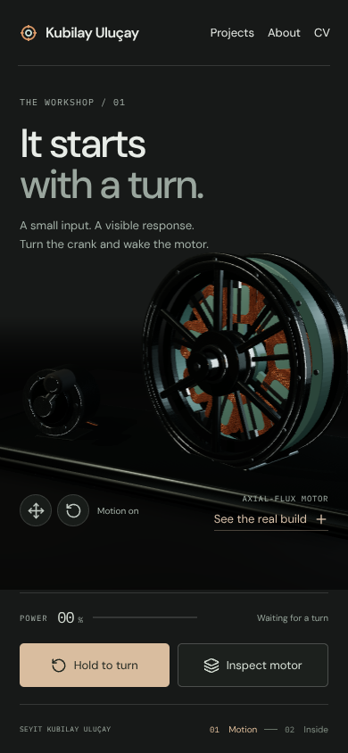 | 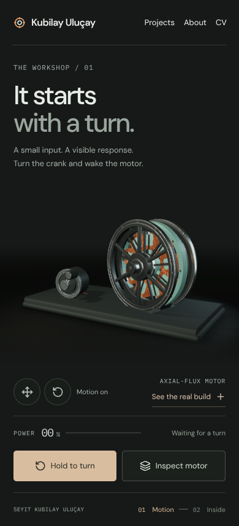 |
| powered | 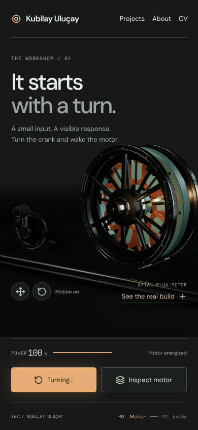 | 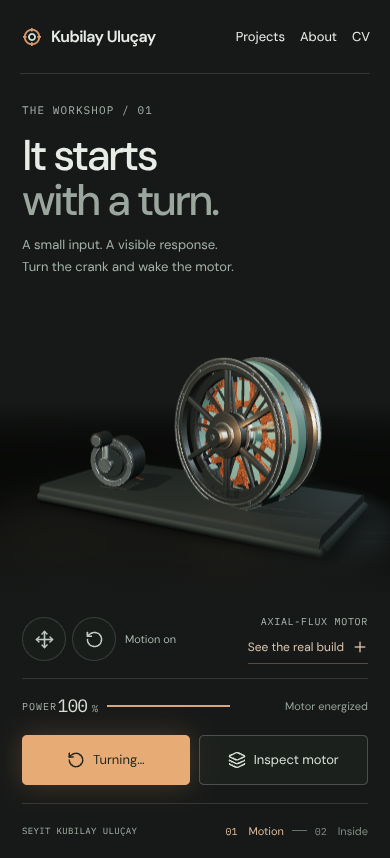 |
| exploded | 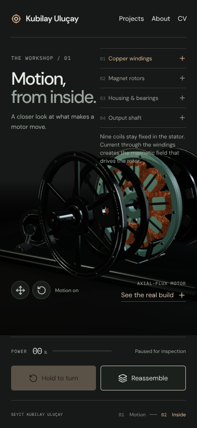 | 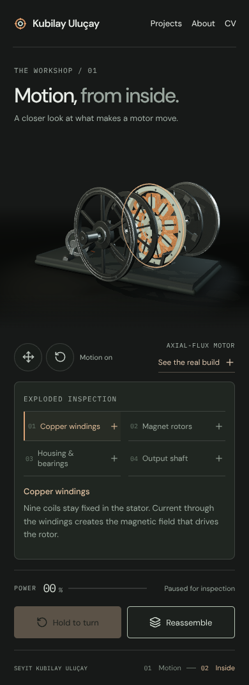 |
| shaft-selected | 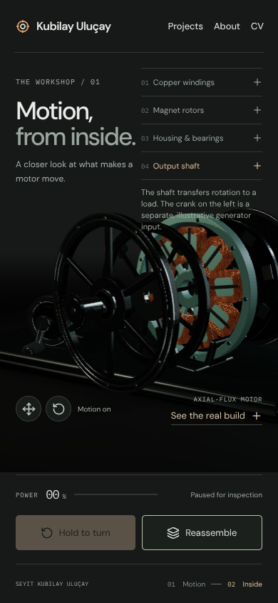 | 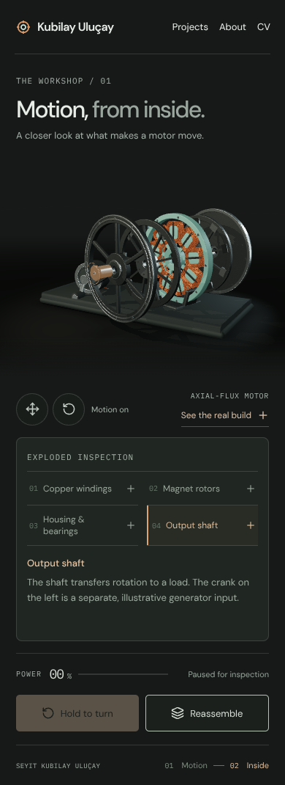 |

Mobile inspection intentionally scrolls to keep text clear of the geometry.

## Desktop — 1440 × 1000

| State | Before | After |
| --- | --- | --- |
| idle | 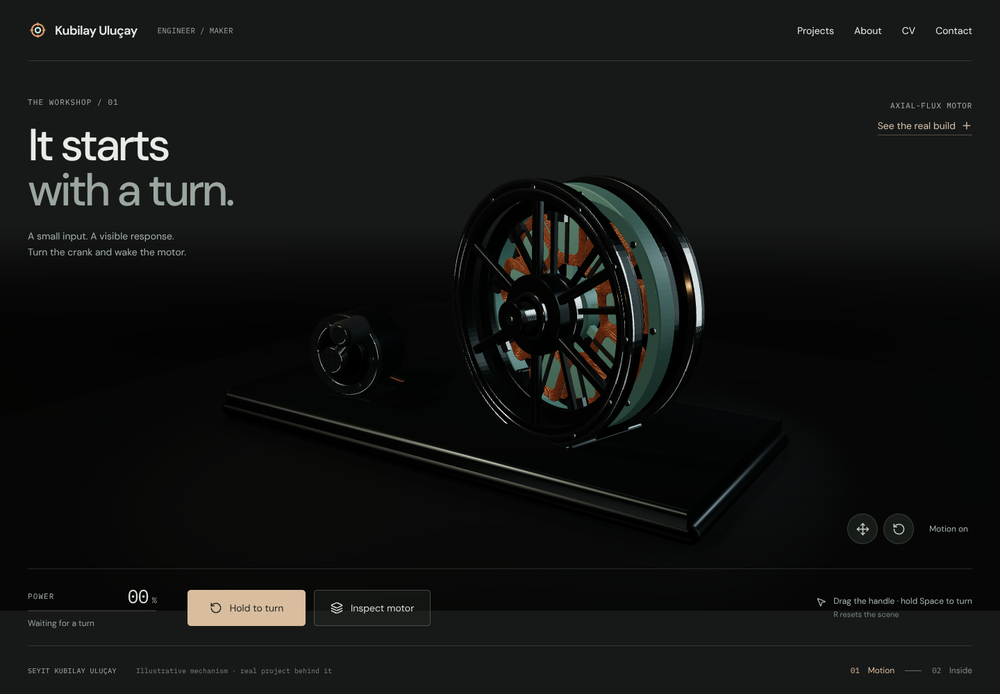 | 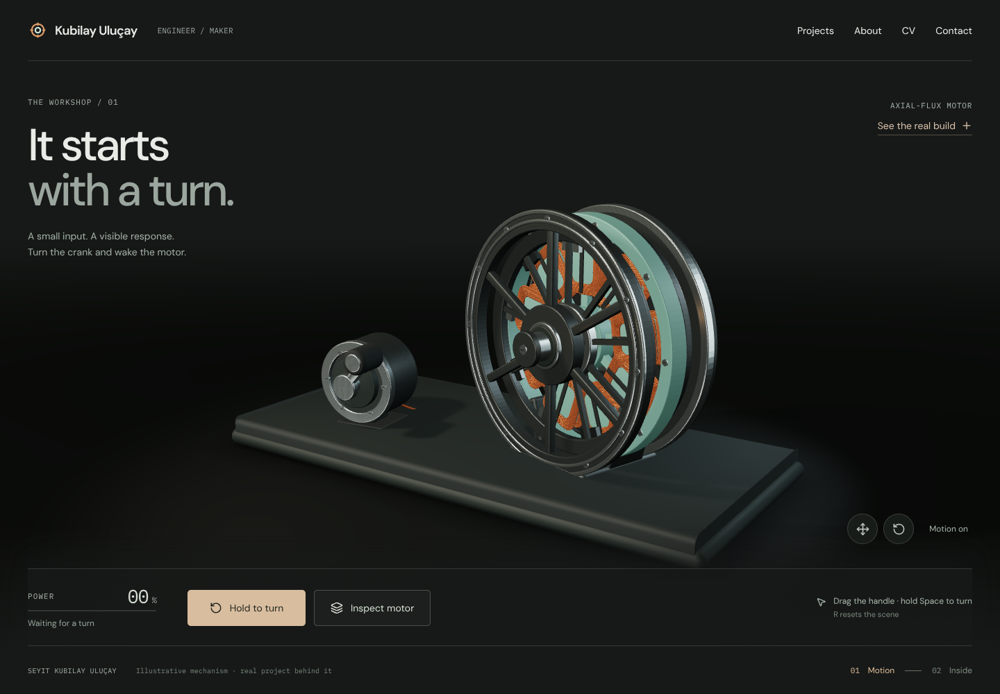 |
| powered | 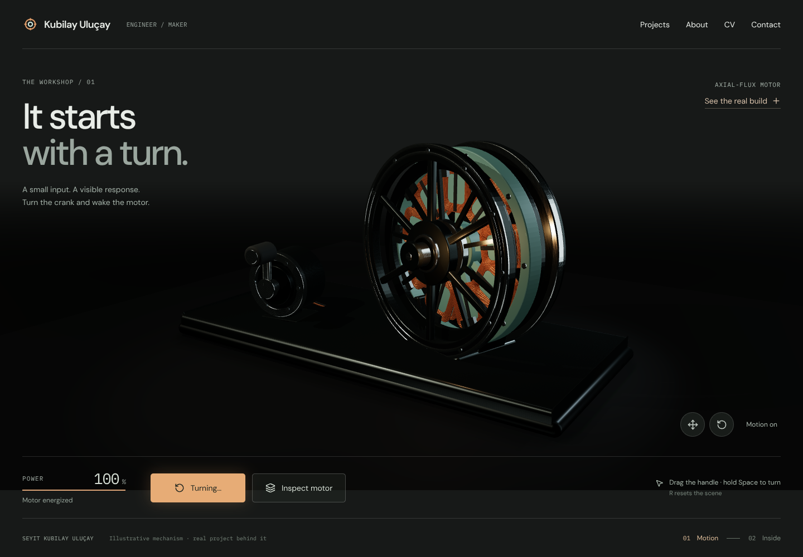 | 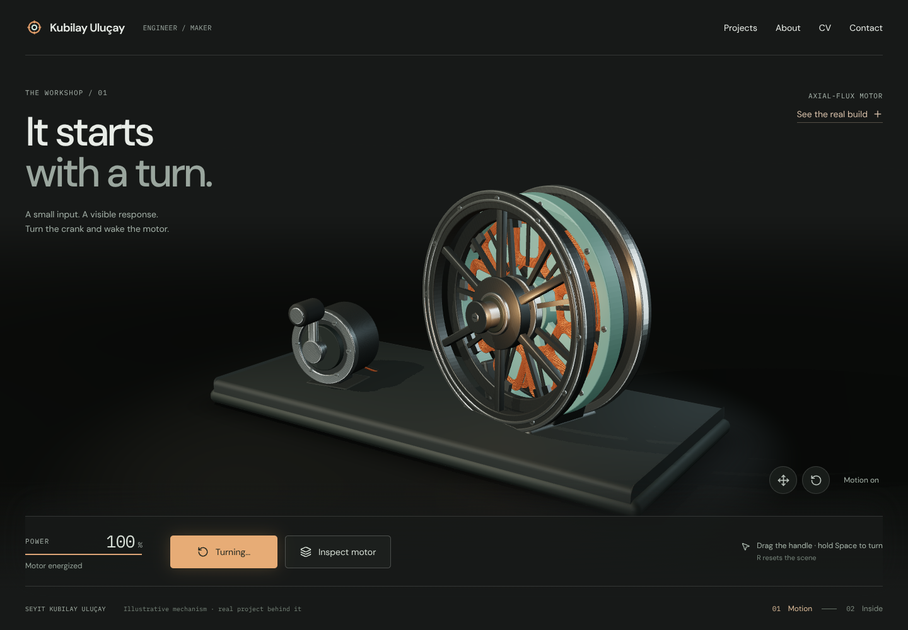 |
| exploded | 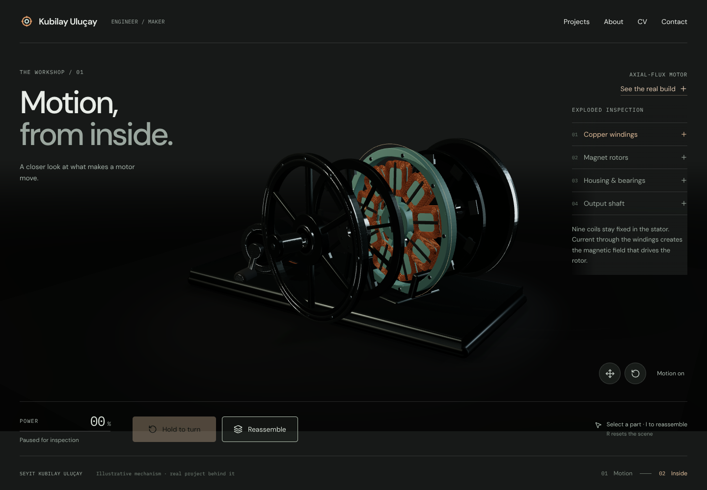 | 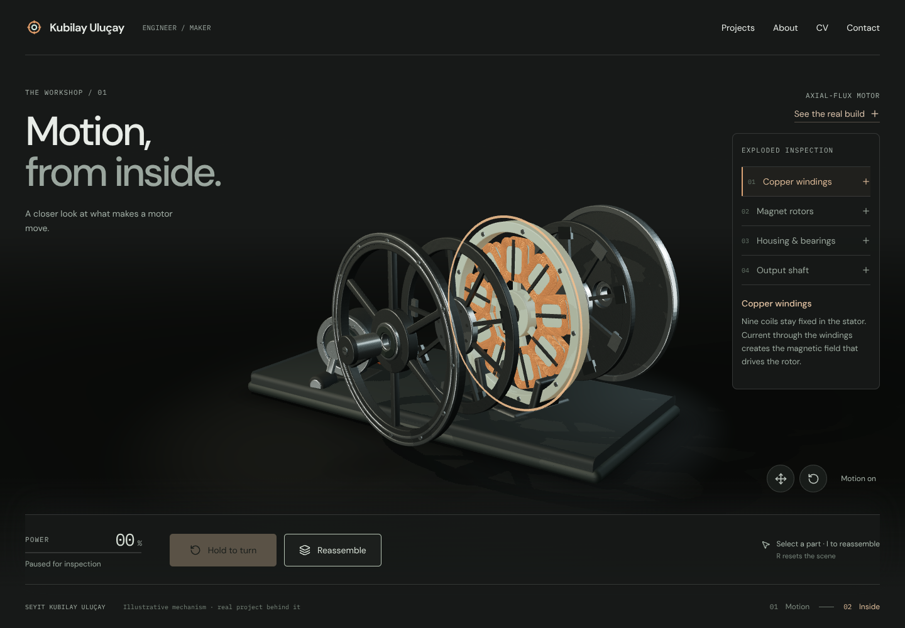 |
| shaft-selected | 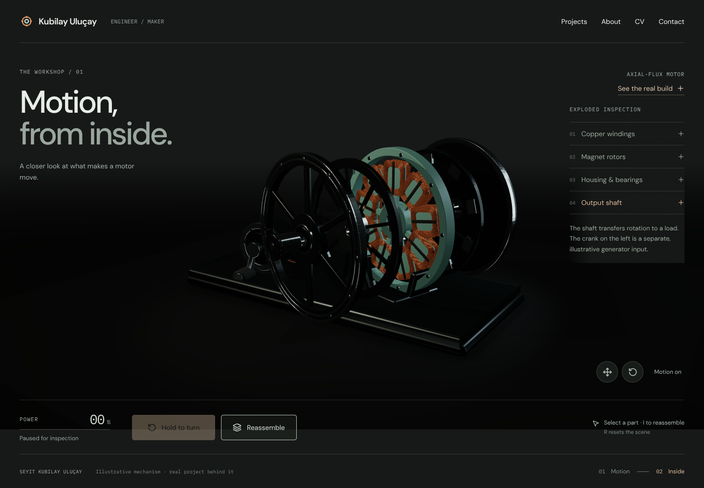 | 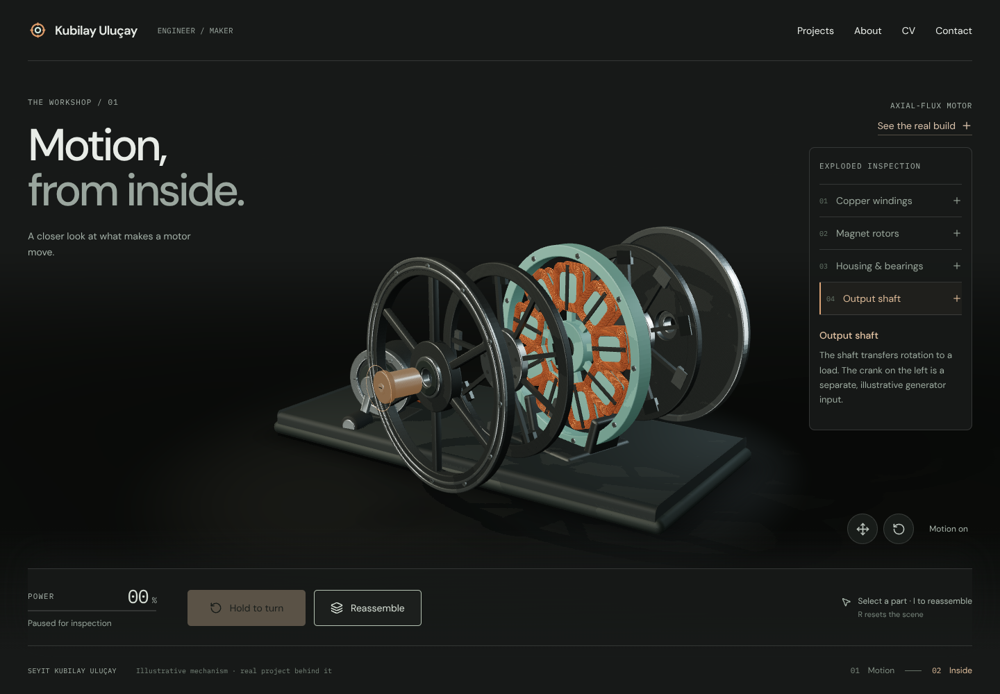 |

## Additional final checks

No matching before captures were taken at these additional viewport sizes.

| State | Mobile 360 × 844 | Desktop 1365 × 768 |
| --- | --- | --- |
| idle | [Original PNG](after/mobile-360-idle.png) | [Original PNG](after/desktop-1365-idle.png) |
| powered | [Original PNG](after/mobile-360-powered.png) | [Original PNG](after/desktop-1365-powered.png) |
| exploded | [Original PNG](after/mobile-360-exploded.png) | [Original PNG](after/desktop-1365-exploded.png) |
| shaft-selected | [Original PNG](after/mobile-360-shaft-selected.png) | [Original PNG](after/desktop-1365-shaft-selected.png) |
